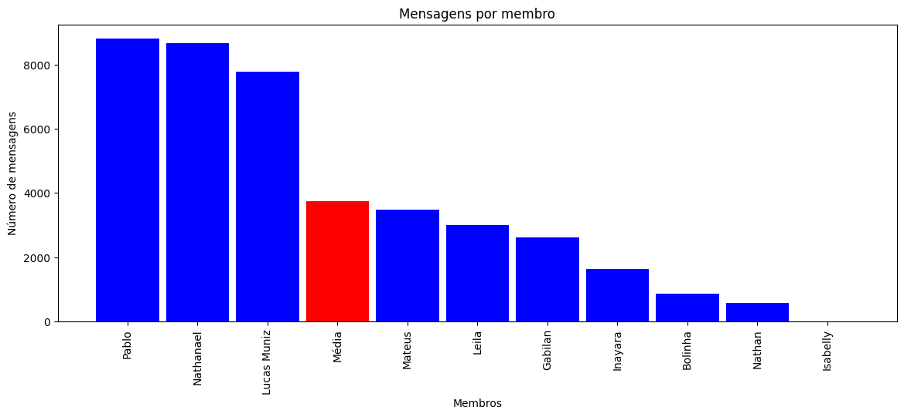
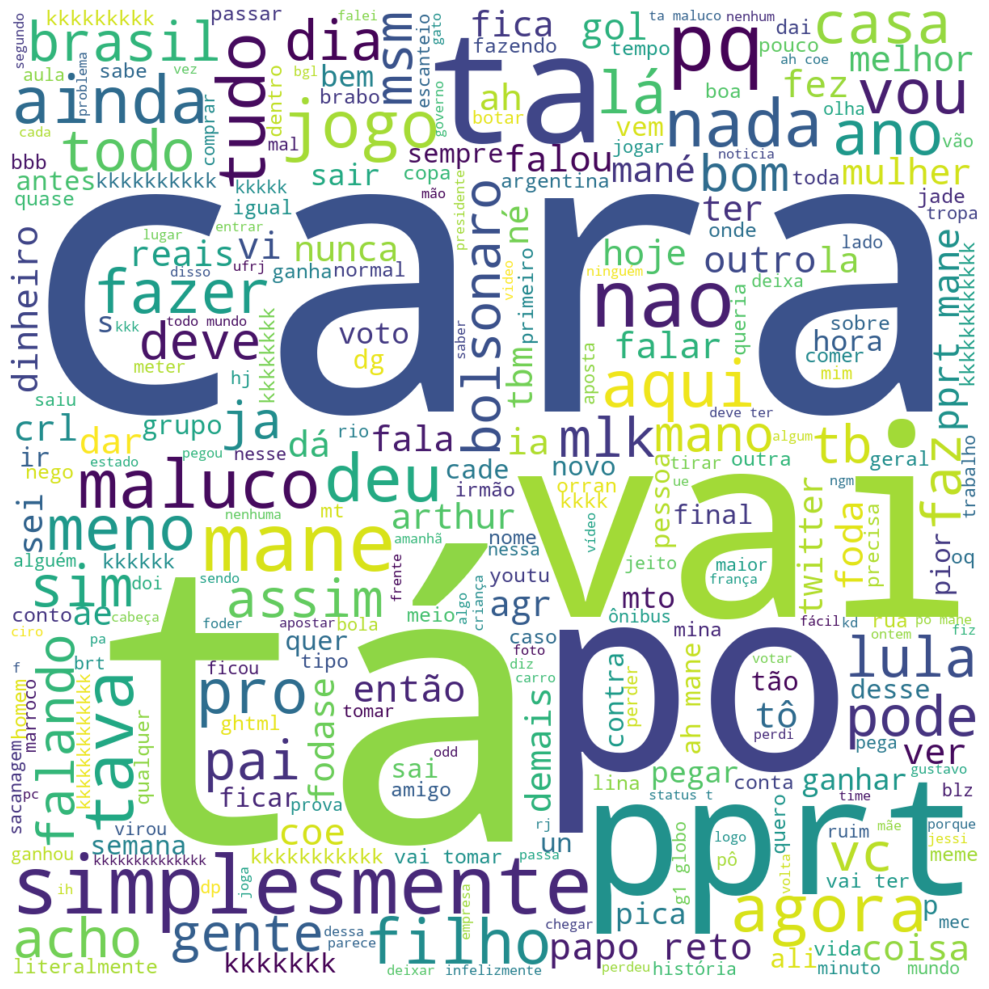

# Visualização de dados de conversas de whatsapp

Com o auxílio do módulo <a href="https://github.com/joweich/chat-miner">chatminer</a>, podemos transformar um conversa de WhatsApp, Telegram e Instagram em um dataframe do pandas.

O notebook que criei usa apenas o WhatsApp, mas você pode fazer com conversas de telegram e instagram também. Basta apenas trocar a função `WhatsAppParser` por `TelegramJsonParser` ou `InstagramJsonParser`.

# 1 - Como exportar as conversas do WhatsApp?
Em primeiro lugar, abras as configurações do aplicativo. Depois, toque em "Conversas".

Depois, acesse "Exportar conversa" e selecione quais chats você quer exportar para txt. Para que o programa funcione, exporte apenas os textos.

 
 

# 2 - Resultados
## 2.1 - Bar plot por mensagens enviadas por membro

Obrigado, Isabelly, por ser tão participativa.

## 2.2 - Heat map de mensagens por dia do ano

Nota-se que o grupo ficou mais ativo durante a apuração das eleições.

## 2.3 - Radar chart de mensagens por dia da semana

## 2.4 - Sunburst chart de mensagens por hora do dia

## 2.5 - Word cloud do chat

Não repare na qualidade da conversa, mas sim na ideia geral do projeto.
